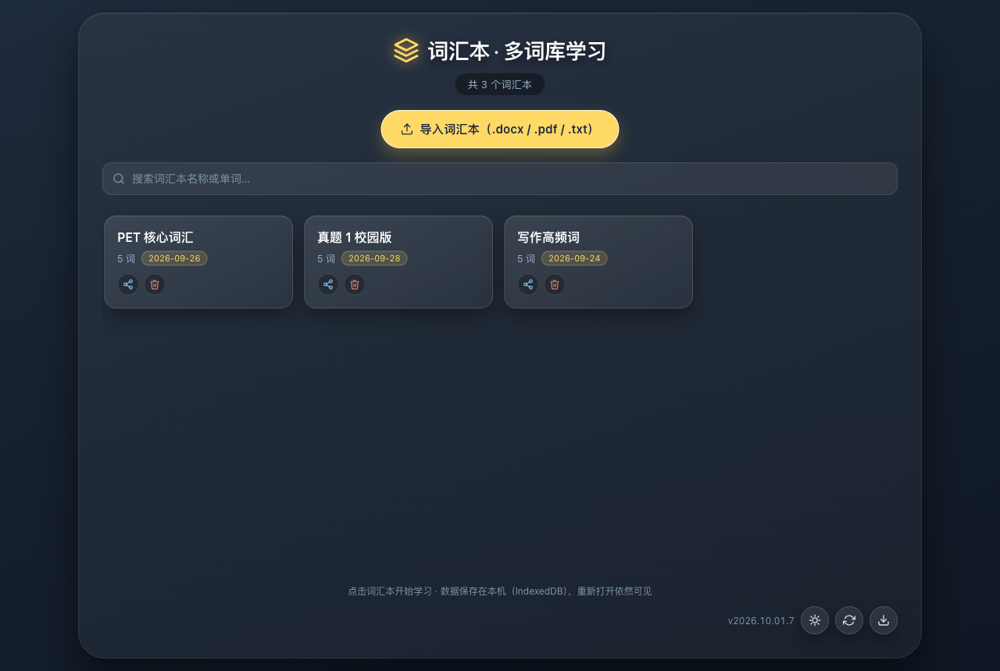
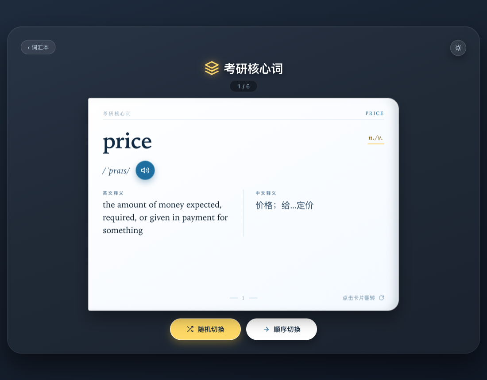
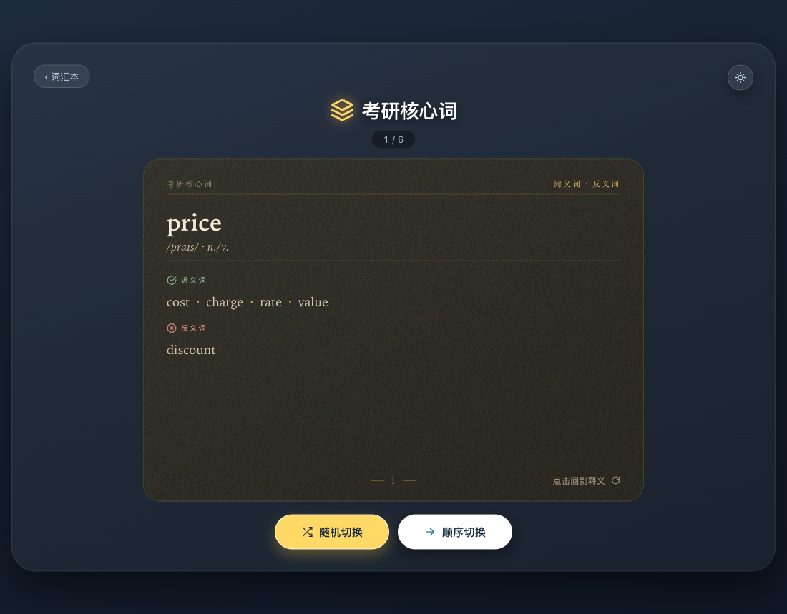
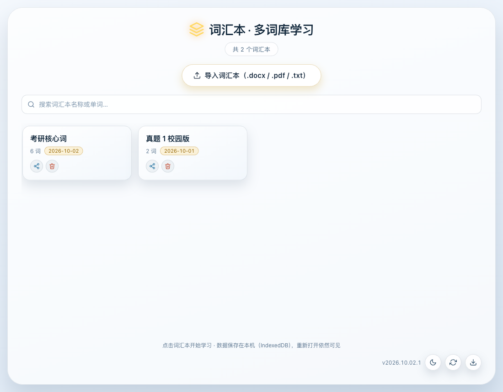

<div align="center">


# 词汇本 · 多词库学习

**一个单文件、零构建的英语词汇学习应用。**
导入 `.docx` / `.pdf` / `.txt` 词表，自动联网补全释义，卡片式记忆；数据只存在本机。

[](https://github.com/geek-xin/vocabulary-notebook/releases/latest)
[](https://github.com/geek-xin/vocabulary-notebook/actions/workflows/release.yml)
[](LICENSE)
[](#-下载与安装)

[在线使用](https://geek-xin.github.io/vocabulary-notebook/) · [下载安装包](https://github.com/geek-xin/vocabulary-notebook/releases/latest) · [设计文档](docs/design.md) · [版本历史](docs/history.md)

</div>



<div align="center">

*深色 / 浅色主题，数据全部保存在本机浏览器*

</div>

---

## ✨ 为什么是「单文件」

整个应用就是**一个 `index.html`**（约 190 KB，gzip 后 56 KB），内含全部 HTML / CSS / JavaScript：

- **没有构建步骤** —— 没有打包器、没有转译、不用 `npm install`
- **双击即用** —— `file://` 直接打开，不需要起本地服务器
- **下载一个文件就是完整应用** —— 应用内的「下载」按钮把它存成单个 HTML，离线可用
- **没有后端** —— 数据只存在你自己的浏览器里，不上传任何服务器

## 📸 界面预览

| 学习卡片（正面） | 卡片背面（近反义词） |
| :---: | :---: |
|  |  |

| 书架（深色） | 书架（浅色） |
| :---: | :---: |
|  |  |

## 🚀 快速开始

### 方式一：在线使用（推荐）

打开 **<https://geek-xin.github.io/vocabulary-notebook/>** 即可。手机浏览器同样适用，
可「添加到主屏幕」当 App 用，支持离线打开。

### 方式二：下载单文件

从 [Releases](https://github.com/geek-xin/vocabulary-notebook/releases/latest) 下载 `vocabulary-notebook.html`，双击打开。

### 方式三：克隆仓库

```bash
git clone https://github.com/geek-xin/vocabulary-notebook.git
cd vocabulary-notebook
open index.html        # macOS；Windows 直接双击 index.html
```

无需任何安装或构建。

## 📦 下载与安装

| 平台 | 文件 | 说明 |
| --- | --- | --- |
| **Web / PWA** | 打开[在线地址](https://geek-xin.github.io/vocabulary-notebook/) | 手机可「添加到主屏幕」 |
| **Android** | [`vocabulary-notebook.apk`](https://github.com/geek-xin/vocabulary-notebook/releases/latest/download/vocabulary-notebook.apk) | 允许安装未知来源后安装；**支持应用内无感升级** |
| **iOS** | [`vocabulary-notebook.ipa`](https://github.com/geek-xin/vocabulary-notebook/releases/latest/download/vocabulary-notebook.ipa) | 未签名，需用 Xcode / AltStore / Sideloadly **自行签名** |
| **单文件** | [`vocabulary-notebook.html`](https://github.com/geek-xin/vocabulary-notebook/releases/latest/download/vocabulary-notebook.html) | 直接双击打开 |

> 产物文件名固定不带版本号，上面的链接始终指向最新版。

**Android 应用内升级**：发现新版本后在应用内直接下载并拉起系统安装器，无需跳浏览器。
首次使用需授予一次「安装未知应用」权限（Android 8.0+ 的系统要求）。

> 💡 **各端数据相互独立。** 词汇本按来源隔离存储，网页版 / 单文件 / Android / iOS 各有一份，
> 互不同步。升级安装包不会丢数据，换端需用应用内「分享」导出导入。

## 🎯 特性

| | 特性 | 说明 |
| --- | --- | --- |
| 📚 | **多词库书架** | 每个导入的文件生成独立词汇本，卡片网格展示，支持删除与分享 |
| 🃏 | **卡片式学习** | 点卡片翻到近反义词（转到侧面时换面）；方向键切换；点页码直接跳转 |
| 🌐 | **全在线释义** | 不内置词库，联网补全音标、词性、中英释义与近反义词 |
| 🔊 | **英式发音** | 点击喇叭播放 |
| 🌗 | **深浅色主题** | 跟随系统，也可手动切换并记住 |
| 📄 | **三种词表格式** | `.docx`（mammoth）/ `.pdf`（pdf.js）/ `.txt`（自动识别 GBK 等编码，无需联网） |
| 💾 | **三级存储降级** | IndexedDB → localStorage → 内存，尽可能不丢数据 |
| 📈 | **学习进度** | 每个词汇本独立记忆上次位置 |
| 📤 | **分享** | 打包成独立 HTML 走系统分享（可发微信），接收方离线可看 |
| 📲 | **PWA** | 可安装，离线可开，已补全的释义仍可查看 |
| 🔄 | **自动检查更新** | 启动时查 GitHub Releases，发现新版本提示；GitHub 不通时自动换镜像重试 |

## 📥 导入词表

点击首页「导入词汇本」，可一次多选批量导入：

| 格式 | 解析方式 | 是否需要联网 |
| --- | --- | --- |
| `.docx` | mammoth（CDN 按需加载） | 首次需要 |
| `.pdf` | pdf.js（CDN 按需加载） | 首次需要 |
| `.txt` | 内置解码，识别 UTF-8 / BOM / UTF-16 / **GBK** | **不需要** |

导入后应用会从文档中提取英文词条，然后**全部联网补全**释义：

- **中文释义与词性** —— 有道词典 suggest 接口（JSONP）
- **英文释义、近反义词、音标** —— Datamuse API（CORS）

导入后词汇本先显示为**骨架卡**（标题旁显示「联网补全中 N / M」与进度条），
**补全成功才换成可进入的真实卡片** —— 这样不会先看到一屏释义为 `—` 的空卡。
结果按词缓存，二次打开零请求；
补全失败（离线或接口全挂）时骨架卡给出「重试」与「仍然查看」，数据始终已保存，下次联网自动回填。

### 支持什么格式的词表

解析器同时用「整篇扫描」和「逐段解析」两种方式，取词条更多的那一路，因此对下列写法都宽容：

```
1. price            2) reduce           ① career
1．successful       3、furniture        • competition
```

## ❓ 常见问题

<details>
<summary><b>为什么卡片没有例句？</b></summary>

目前没有可用的免费跨域例句来源。数据最全的有道 `jsonapi`（含 IPA 音标与双语例句）
**既没有 CORS 头、加 `callback` 还返回 403**，浏览器无法调用；`api.dictionaryapi.dev`
在目标网络不可达；Tatoeba 返回 HTML 而非 JSON API。

因此例句区块在无值时**整块隐藏**，而不是挂一个永远显示 `—` 的空框。
将来若接上可用来源会自动恢复显示。
</details>

<details>
<summary><b>音标为什么有时看起来是美音？</b></summary>

音标来自 Datamuse 的 ARPAbet 音素（`P R AY1 S`），由应用内的转换器转成 IPA（`/ˈpraɪs/`）。
这是**美式**发音的机械转换结果，未经人工校对。发音音频则是英式（有道 `type=1`），两者口音并不一致。
</details>

<details>
<summary><b>没网还能用吗？</b></summary>

界面可以离线打开（PWA 外壳已缓存），已补全的释义也在本地。但**新词的释义补不上** ——
因为释义全部来自在线词典。导入本身不联网也能完成，卡片会保持空白，联网后自动回填。
</details>

<details>
<summary><b>换手机 / 换浏览器，数据会同步吗？</b></summary>

不会。词汇本存在浏览器按**来源（origin）**划分的本地存储里，不上传任何服务器。
换设备、换浏览器、清理浏览器数据都会导致数据不互通或不复存在。

需要搬运时用应用内的「分享」导出成 HTML 带走。
</details>

<details>
<summary><b>Android 安装时提示「签名不一致」怎么办？</b></summary>

这是 **2026.10.01.7 之前**的旧版本才有的问题：早期 CI 每次都用新生成的调试密钥签名，
导致每次发版签名都不同，系统拒绝覆盖安装。

新版已改为固定密钥签名，此后的版本可以正常覆盖升级。
旧版用户需要先用「分享」导出词汇本 → 卸载旧版 → 安装新版 → 重新导入。
</details>

<details>
<summary><b>导入的词表词条数不对 / 有漏词？</b></summary>

导入完成后的报告会列出解析条数、重复合并数与**未识别行**（最多列 40 行），
而不是静默少词。如有未识别行，可据此调整源文件格式后重新导入。
</details>

## 🏗️ 技术说明

### 架构

```
index.html                 应用本体（唯一事实来源，含全部逻辑与样式）
├── manifest.json          PWA 清单
├── sw.js                  Service Worker（离线外壳 + 更新通道）
├── icons/                 图标（根目录是唯一事实来源）
└── 分发层（不改变本体形态）
    ├── android/           Capacitor 壳 → APK
    │   └── tools/         从 icons/ 派生 Android mipmap 全套
    ├── ios/               Capacitor 壳 → 未签名 ipa
    ├── scripts/           图标生成 / 资源同步 / 版本写入 / 测试
    └── .github/workflows/ 打 tag 自动构建并发布
```

`www/` 是 `scripts/sync-web.mjs` 从根 `index.html` 生成的派生产物，不进版本库 ——
仓库里始终只有**一份**应用本体，不存在多份 HTML 漂移的问题。

### 外部依赖

全部按需从 CDN 加载，并按序回退（jsDelivr → BootCDN → staticfile → cdnjs），不影响离线使用：

| 用途 | 来源 |
| --- | --- |
| 解析 `.docx` | mammoth |
| 解析 `.pdf` | pdf.js |
| 中文释义与词性 | 有道 suggest（JSONP） |
| 英文释义、近反义词、音标 | Datamuse（CORS） |
| 英式发音 | 有道 dictvoice |

### 数据存储

三级降级，尽可能保证数据不丢：

1. **IndexedDB** —— 首选，配额远大于 localStorage，移动端 WebView 更稳
2. **localStorage** —— IndexedDB 不可用时自动降级
3. **内存** —— 前两者都不可用时的最后手段（刷新即丢，应用会提示）

旧版本存在 `localStorage` 的词汇本会在首次打开时自动迁移。

## 🔧 开发与构建

Web 端无需构建，其余各端：

```bash
npm install

# 测试（内联脚本语法 + Service Worker 行为 + 分享通道，共 51 项断言）
npm test

# 本地起服务，验证 PWA（Service Worker 需要 http/https）
node scripts/serve.mjs

# Android
node scripts/sync-web.mjs && npx cap sync android
cd android && ./gradlew assembleDebug      # 或 assembleRelease

# iOS（需 macOS + Xcode）
npx cap sync ios && ./ios/build-unsigned-ipa.sh
```

### 发版

```bash
node scripts/set-version.mjs 2026.10.02.7   # 一处写入 index.html / package.json / Android / iOS
git commit -am "chore(release): v2026.10.02.7"
git tag v2026.10.02.7 && git push origin main --tags   # 触发构建与发布
```

CI 会校验 `APP_VERSION` 与 tag 一致，不一致直接失败，避免发出对不上的版本。

各端详细的构建、签名与验证边界见 [docs/multi-platform.md](docs/multi-platform.md)。

## 📋 已知限制

| 限制 | 说明 |
| --- | --- |
| 没有例句 | 见 [常见问题](#-常见问题) |
| 音标是美音近似值 | 机械转换，未经人工校对 |
| 释义需要联网 | 不内置词库，首次导入后需联网补全 |
| 各端数据独立 | 按 origin 隔离，不会自动同步 |
| iOS 产物未签名 | 仓库不保存证书，需自行签名 |
| 真机行为未验证 | 无测试设备，WebView 运行时行为未在真机确认 |

## 📚 文档

| 文档 | 内容 |
| --- | --- |
| [docs/README.md](docs/README.md) | 维护者文档索引（从这里开始） |
| [docs/design.md](docs/design.md) | 当前架构与关键设计取舍、边界与不做的事 |
| [docs/multi-platform.md](docs/multi-platform.md) | 多端交付方式、发版流程、各端验证边界 |
| [docs/history.md](docs/history.md) | 版本历史，含踩过的坑与诊断结论 |
| [docs/troubleshooting.md](docs/troubleshooting.md) | 常见故障的「现象 → 原因 → 处理」 |
| [android/README.md](android/README.md) | Android 构建、签名（**固定密钥，勿更换**）、应用内升级 |
| [ios/README.md](ios/README.md) | iOS 构建与三种安装方式 |

> 界面截图是**真实浏览器渲染后截取**的，不是设计稿；界面改动后应重新截取
> （方法见 [docs/README.md](docs/README.md)）。

## 🤝 贡献

欢迎提 Issue 反馈问题或建议。提交代码前请注意：

1. **应用本体只有 `index.html` 一个文件** —— 不要拆分，也不要引入构建步骤；
2. **改完跑一遍 `npm test`**；
3. 涉及设计取舍的改动，请同步更新 [docs/design.md](docs/design.md)；
4. 每次发版在 [docs/history.md](docs/history.md) 顶部加一条，写清「改了什么、为什么、如何验证」。

## 📄 许可证

[CC BY-NC 4.0](LICENSE) © 2026 geek-xin

允许署名前提下的非商业性分享与演绎，**禁止商业用途**。完整条款见 [LICENSE](LICENSE)。

<div align="center">

如果这个项目对你有帮助，欢迎点个 ⭐

</div>
